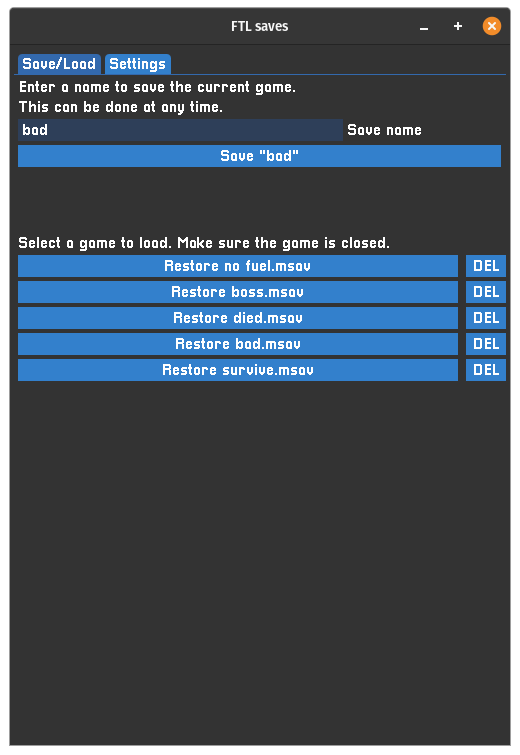

# FTL save manager

Well, I copied `continue.sav` long enough manually, I guess.

This is a very simple tool to back up and restore your FTL save game graphically. You know how to do it, but it's slightly more convenient this way. Engage the rebels!

